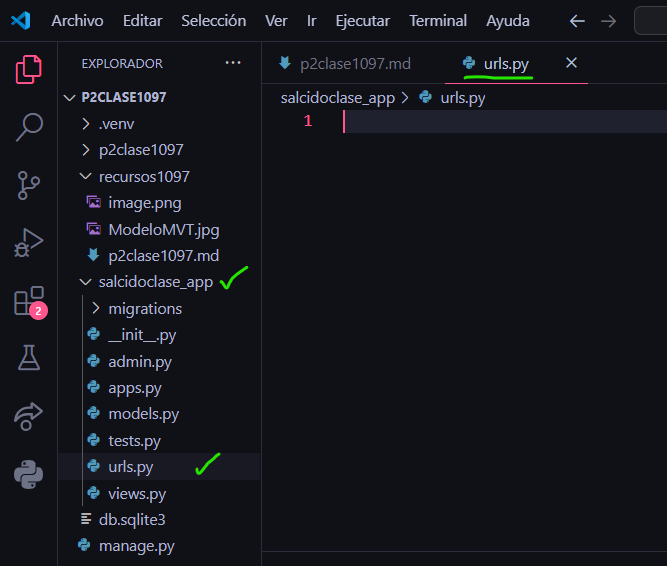
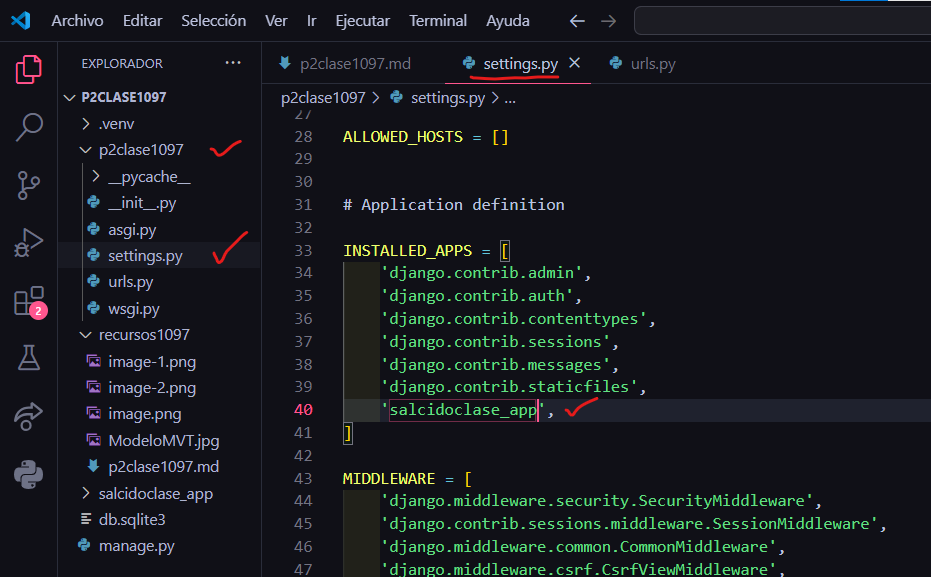
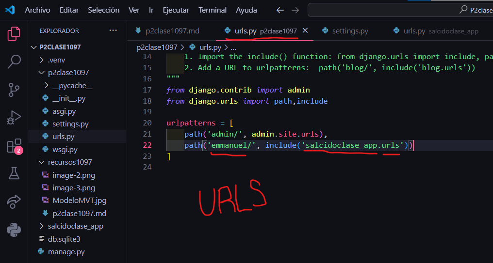
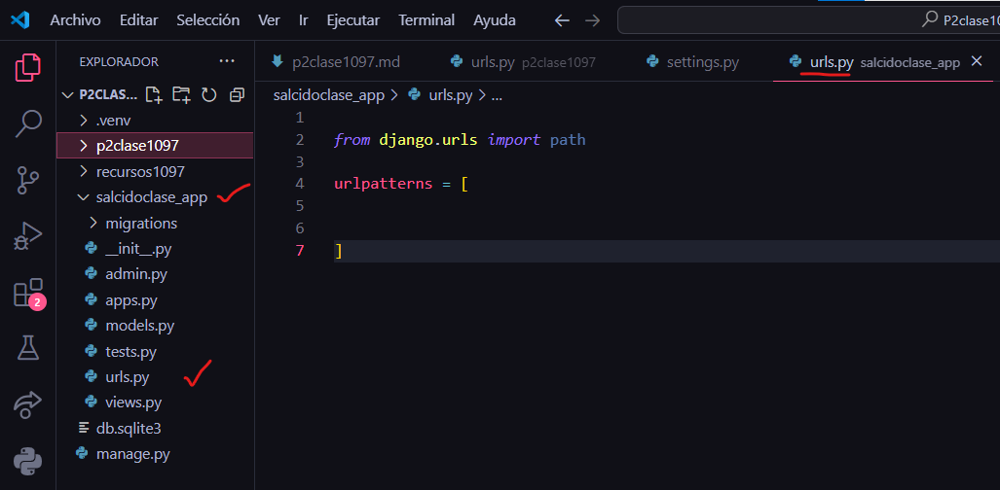
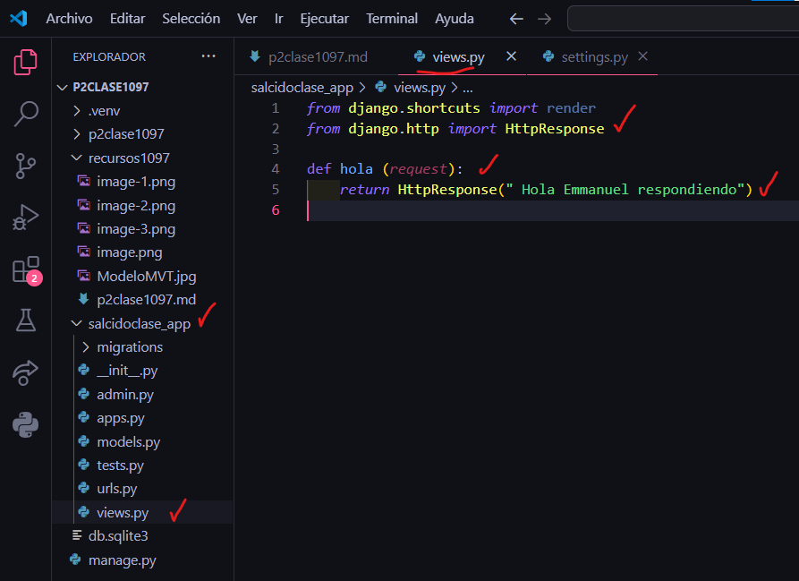
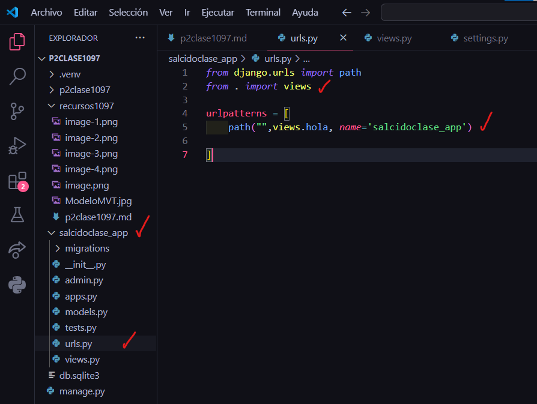

- Crear aplicacion salcidoclase_app
- comando --> python manage.py startapp salcidoclase_app
- Creamos el archivo urls.py en salcidoclase_app
- 
- En setting.py de p2clase1097
- 
- En urls.py de p2clase1097
- 
- En urls.py en salcidoclase_app
- 
- En views.py en salcidoclase_app
- 
- En urls.py en salcidoclase_app
- 